平日に三連休が生えてきたらもう旅行に行くしかないよね。  
というわけで、仕事終わりに夜行バスに乗り込み腰を痛めながら名古屋にやってきた。

## 名古屋 弾着



撤去されてからもう何年も経つってのに、あのクソデカモニュメントがない名駅は不思議な感じがするな。東口を頻繁に使ってたわけじゃないけどそれでもなんだかものさみしいわね。リニアが開通したらもっと気楽に来られるようになるのかしら。

そんな感傷に浸りながらコメダで腹ごしらえ。夜行バスでまともに眠れるわけがないんだから、カフェインでブーストしていくぜ。シロノワールは温かさと冷たさが混ざり合う感覚がたまらないんだよね。ダイス状のキットカットもアクセントになってておいしい。朝から甘未を補充できて満足。



エネルギー補給を済ませたところで本命の名鉄シングレコラボに向かう。午後にはウマ娘好きの友人とスイパラで合流した後に笠松へ向かう予定だったので、先にスタンプを埋めておこうと太田川から回っていく。キャラの数合わせだとは思うけどなぜ太田川と刈谷なのですか……乗り換え増えてちと面倒じゃった

  

## 中京競馬場

そして名駅に帰る道中くっっっっそ熱い中(notTypo)中京競馬場に向かう。  
平日ど真ん中なので外側をぐるっと回るくらいしかできなかったけど、それでもスズカ広場や歴代優勝馬の碑を見られてよかったなぁ。

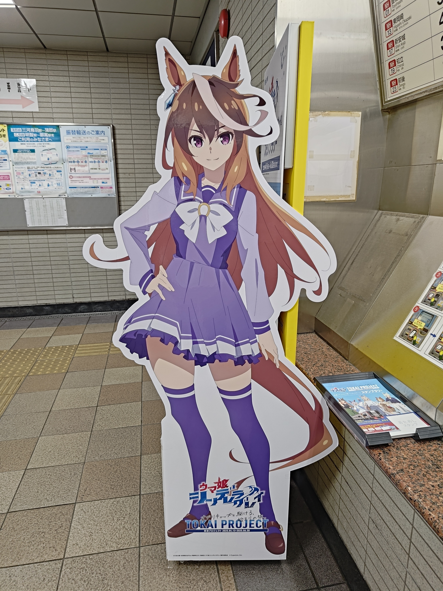 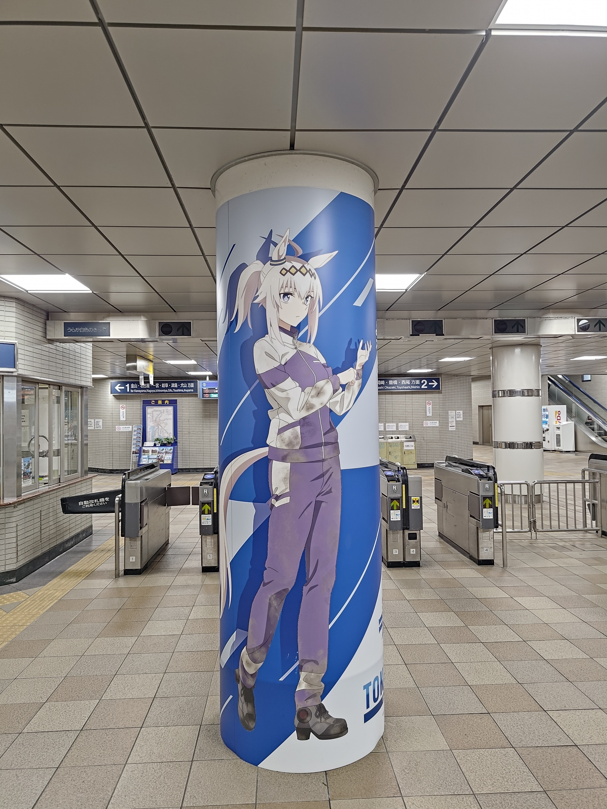 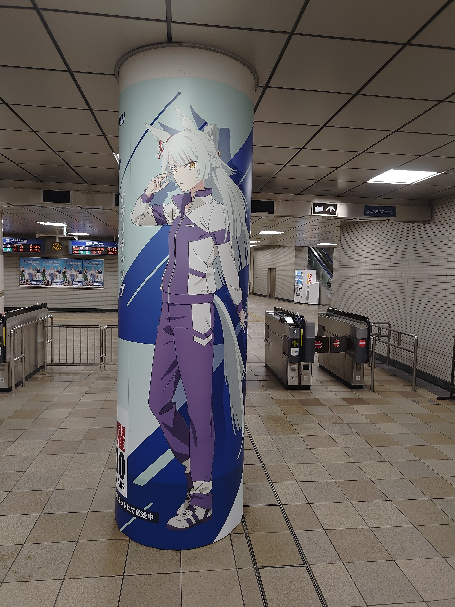

 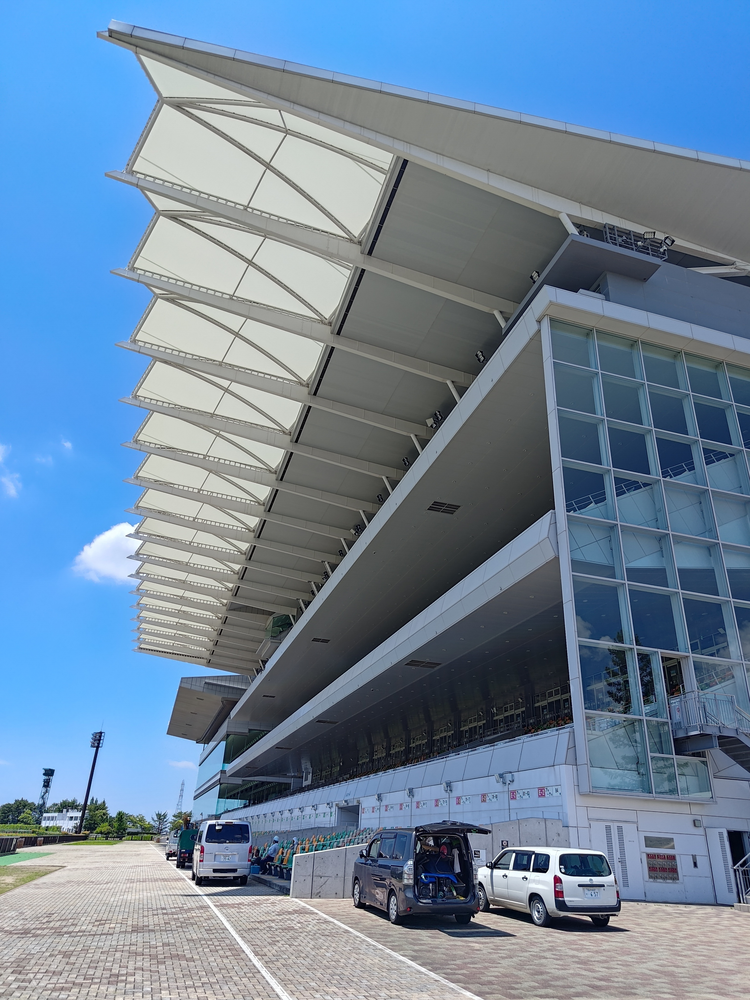 

## 名古屋に戻ってくる

疲れた体にこの世で一番うまい汁無し担々麺を流し込み、スイパラに向かう。  
らーめん六弦の汁無し担々麺が一番うまいんだから。残った汁にごはんをぶっこむ〆はいずれがんにも効くようになる。

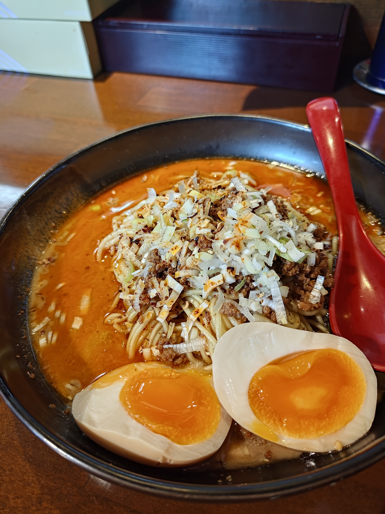 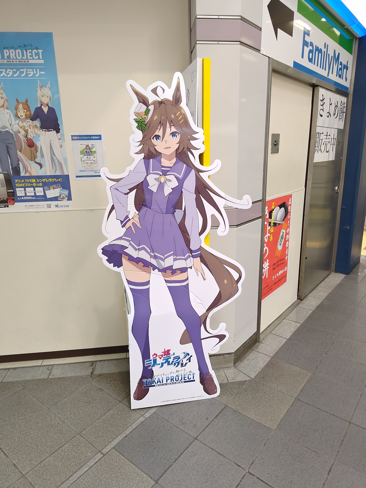

タマモプレートが一番見た目は可愛かったな。ただあの青いゼリー味が無くて不思議な気分に。  
ルドルフ推しの友人は嗚咽を漏らしながら最中を食べててうけるな。スイパラは小麦粉もの食べてるとすぐにおなか一杯になっちゃうからムースをメインにするべし。
てかスイパラコラボのベルノめちゃくちゃ可愛くないか？？？？アニメのベルノもかなり好きだったけどこっちもよきだ……

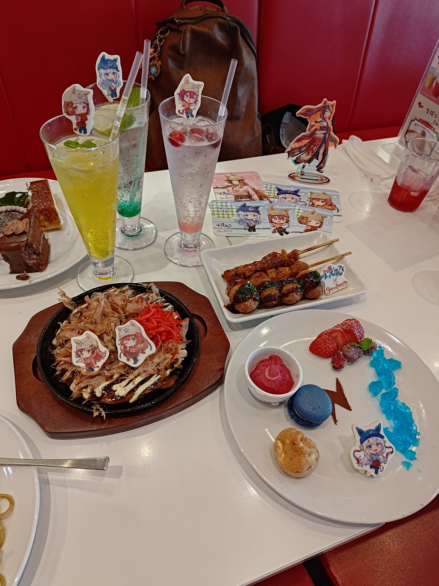 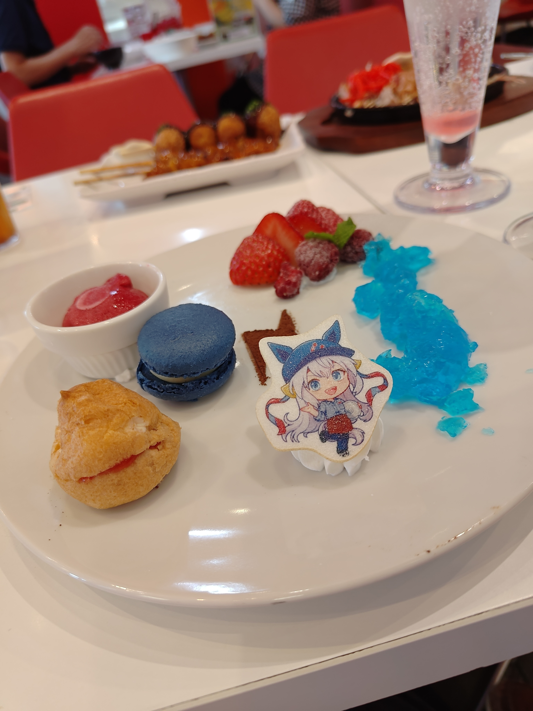 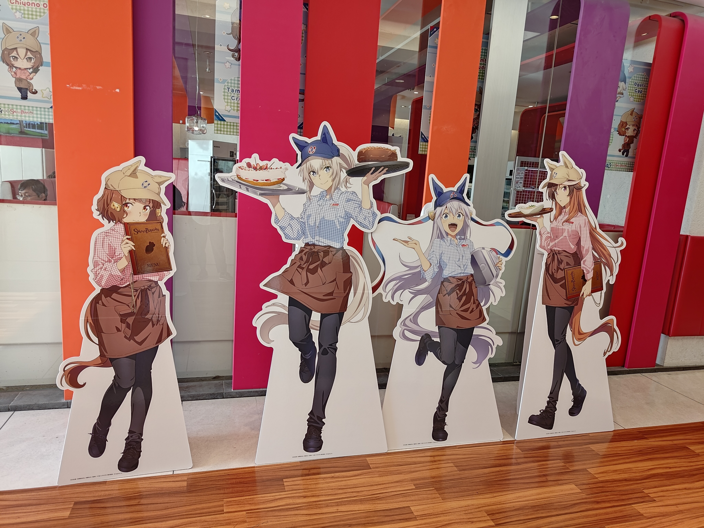

## そして笠松へ

もう陽も落ちてだいぶ暗くなってたけどまだまだ暑かったなぁ。  
室内観客席(?)は空いていてなんとか涼むことができたし、ちょうど船橋競馬の中継をしていた。時間がなかったから実況中継はあきらめてOPで出てきた橋に向かう途中にも、見たことのある景色がたくさんでオタク心がくすぐられるくすぐられる。特にOPはじめに出てくる物見やぐら(あれなんだ?)がいっちゃんテンション上がる↑↑↑↑。ドロスが聞こえてくるのも空耳じゃないね。

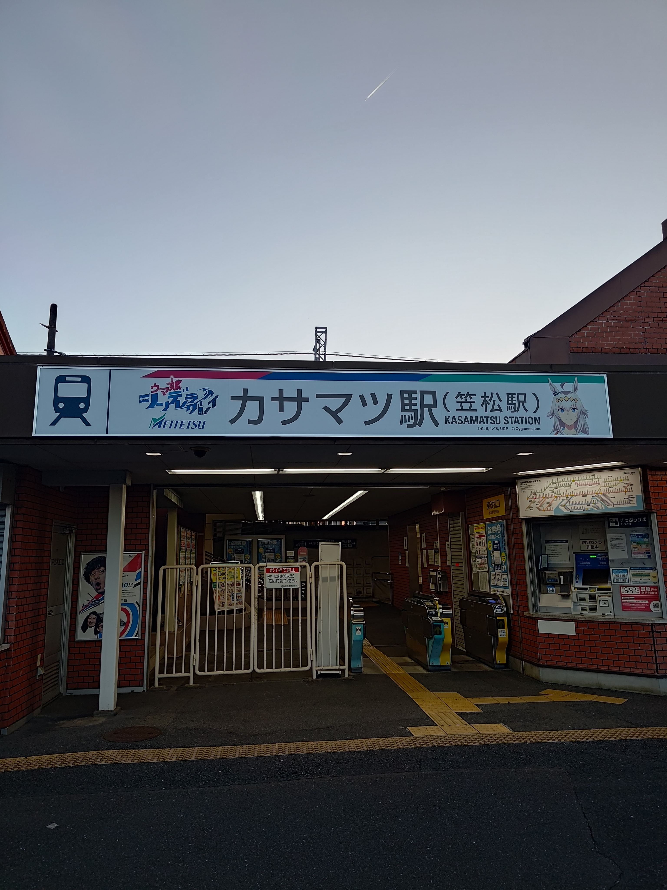 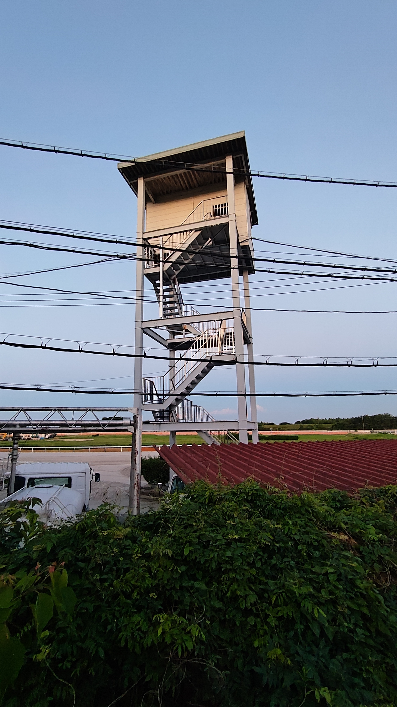 

そもそも仕事終わりに夜行バスで愛知に来てからずっと活動していたので疲労はピークを迎えていた。さらに駅から微妙に遠い橋に向かってかってぇコンクリートを歩いてきたから足が棒だよ。カフェインとドーパミンだけで動いていた体を引きずって何とか駅に着き名古屋までは爆睡。寝過ごす前になんとか体を起こして友人に別れを告げる。疲労困憊で終わり散らかしてるけどまだ行くところがある、愛知で一番うまい豚骨ラーメン屋へ。

## 駅西ラーメンをすこれ！

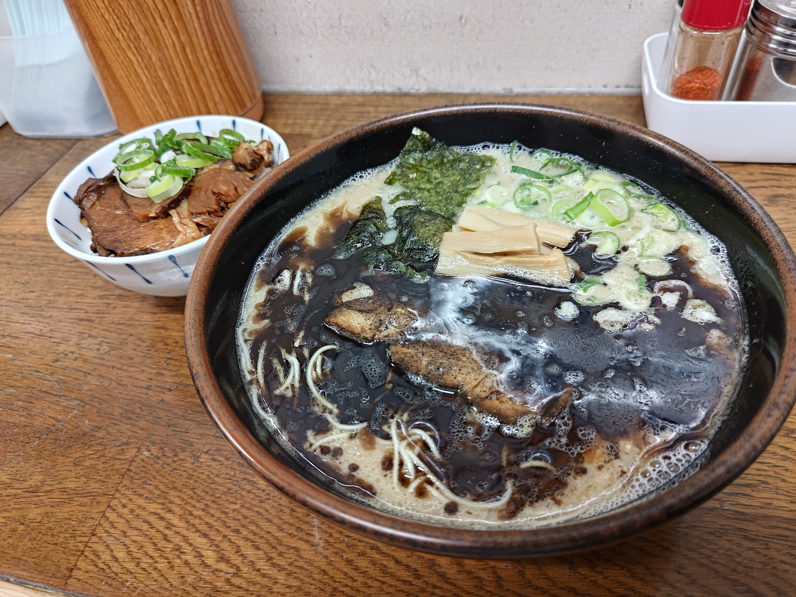 

このクリーミーな豚骨スープと香ばしいマー油に固めの細麺ストレートをくぐらせる喜びを知らない人は今すぐ食べに行ってほしい。名駅西口の雑然とした飲み屋街にひっそりとたたずむ店構えがたまらないんだ（店の外観を撮り忘れちゃったけど。そして沁みっ沁みのチャーシュー丼は惜しみなくタレがかかっており、濃い味好きの愛知県民を十分に満足させてくれる。ﾊﾔﾚ 



一度やってみたかったホテル飲み。そもそも旅行をあまりしてこなかった人生であり、合宿や社会人になってからの旅行も他人に宿取りを任せていたからとっても新鮮だぁ。本当はハーツクライのぬいを連れてくるつもりだったのにうっかり忘れちゃってた……幸いアニメイトにウマ娘のアクスタが売ってたから意を決してシュヴァちをお迎え。推しがたくさんいるとみんなほしくなっちゃうから我慢してたのになぁ。まぁシュヴァちと旅行できるしいっか！

残り二日大阪で遊び倒してきた記録も付けたいけど慣れないマークダウンにつかれた……やる気があるときにちまちま書いてこ